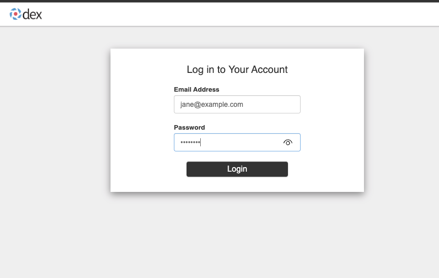
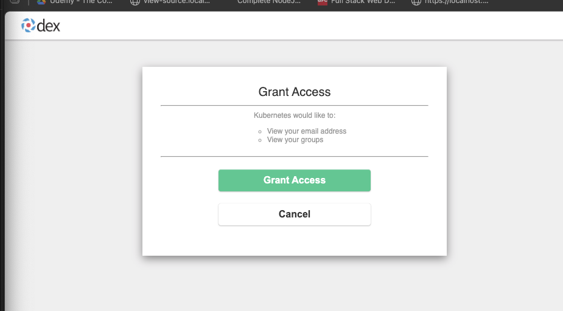

You'll deploy Dex as a self-hosted OIDC provider, configure a kind cluster to trust it, and log in with a browser. Dex is a good demo vehicle because it runs inside the cluster and doesn't require a cloud account or an external service.

> **This guide is for local development and learning only.** Self-signed certificates, static passwords, and certs stored on disk are used here for simplicity. In production, use a managed identity provider (Azure Entra ID, Google Workspace, Okta), automate certificate lifecycle with cert-manager, and store secrets in a secrets manager (HashiCorp Vault, AWS Secrets Manager) or inject them via CSI driver — never commit or store certs as local files.

### Step 1: Create a kind cluster with OIDC authentication

OIDC authentication for the API server must be configured at cluster creation time on Kind because the API server needs to know which identity provider to trust before it starts accepting requests.

> **Note:** Kubernetes v1.30+ deprecated the `--oidc-*` API server flags in favor of the structured `AuthenticationConfiguration` API (via `--authentication-config`). In v1.35+ the old flags are removed entirely. This guide uses the new approach.

> **nip.io** is a wildcard DNS service — `dex.127.0.0.1.nip.io` resolves to `127.0.0.1`. This lets us use a real hostname for TLS without editing `/etc/hosts`.

First, generate a self-signed CA and TLS certificate for Dex:

```bash
# Generate a CA for Dex
openssl req -x509 -newkey rsa:4096 -keyout dex-ca.key \
  -out dex-ca.crt -days 365 -nodes \
  -subj "/CN=dex-ca"

# Generate a certificate for Dex signed by that CA
openssl req -newkey rsa:2048 -keyout dex.key \
  -out dex.csr -nodes \
  -subj "/CN=dex.127.0.0.1.nip.io"

openssl x509 -req -in dex.csr \
  -CA dex-ca.crt -CAkey dex-ca.key \
  -CAcreateserial -out dex.crt -days 365 \
  -extfile <(printf "subjectAltName=DNS:dex.127.0.0.1.nip.io")
```

Next, generate the `AuthenticationConfiguration` file. This tells the API server how to validate JWT tokens — which issuer to trust (`url`), which audience to expect (`audiences`), and which JWT claims map to Kubernetes usernames and groups (`claimMappings`). The CA cert is inlined so the API server can verify Dex's TLS certificate when fetching signing keys:

```bash
cat > auth-config.yaml <<EOF
apiVersion: apiserver.config.k8s.io/v1beta1
kind: AuthenticationConfiguration
jwt:
  - issuer:
      url: https://dex.127.0.0.1.nip.io:32000
      audiences:
        - kubernetes
      certificateAuthority: |
$(sed 's/^/        /' dex-ca.crt)
    claimMappings:
      username:
        claim: email
        prefix: ""
      groups:
        claim: groups
        prefix: ""
EOF
```

The `kind-oidc.yaml` config uses `extraPortMappings` to expose Dex's port to your browser, `extraMounts` to copy files into the Kind node, and a `kubeadmConfigPatch` to pass `--authentication-config` to the API server:

```yaml
# kind-oidc.yaml
kind: Cluster
apiVersion: kind.x-k8s.io/v1alpha4
nodes:
  - role: control-plane
    extraPortMappings:
      # Forward port 32000 from the Docker container to localhost,
      # so your browser can reach Dex's login page
      - containerPort: 32000
        hostPort: 32000
        protocol: TCP
    extraMounts:
      # Copy files from your machine into the Kind node's filesystem
      - hostPath: ./dex-ca.crt
        containerPath: /etc/ca-certificates/dex-ca.crt
        readOnly: true
      - hostPath: ./auth-config.yaml
        containerPath: /etc/kubernetes/auth-config.yaml
        readOnly: true
    kubeadmConfigPatches:
      # Patch the API server to enable OIDC authentication
      - |
        kind: ClusterConfiguration
        apiServer:
          extraArgs:
            # Tell the API server to load our AuthenticationConfiguration
            authentication-config: /etc/kubernetes/auth-config.yaml
          extraVolumes:
            # Mount files into the API server pod (it runs as a static pod,
            # so it needs explicit volume mounts even though files are on the node)
            - name: dex-ca
              hostPath: /etc/ca-certificates/dex-ca.crt
              mountPath: /etc/ca-certificates/dex-ca.crt
              readOnly: true
              pathType: File
            - name: auth-config
              hostPath: /etc/kubernetes/auth-config.yaml
              mountPath: /etc/kubernetes/auth-config.yaml
              readOnly: true
              pathType: File
```

Create the cluster:

```bash
kind create cluster --name k8s-auth --config kind-oidc.yaml
```

### Step 2: Deploy Dex

Dex is an OIDC-compliant identity provider that acts as a bridge between Kubernetes and upstream identity sources (LDAP, SAML, GitHub, etc.). In this demo it runs inside the cluster with a static password database — two hardcoded users you can log in as. The API server doesn't talk to Dex directly on every request; it only needs Dex's CA certificate (which you inlined in the `AuthenticationConfiguration`) to verify the JWT signatures on tokens that Dex issues.

The deployment has four parts: a ConfigMap with Dex's configuration, a Deployment to run Dex, a NodePort Service to expose it on port 32000 (matching the issuer URL), and RBAC resources so Dex can store state using Kubernetes CRDs.

First, create the namespace and load the TLS certificate as a Kubernetes Secret. Dex needs this to serve HTTPS — without it, your browser and the API server would refuse to connect:

```bash
kubectl create namespace dex

kubectl create secret tls dex-tls \
  --cert=dex.crt \
  --key=dex.key \
  -n dex
```

Save the following as `dex-config.yaml`. This configures Dex with a static password connector — two hardcoded users for the demo:

```yaml
# dex-config.yaml
apiVersion: v1
kind: ConfigMap
metadata:
  name: dex-config
  namespace: dex
data:
  config.yaml: |
    # issuer must exactly match the URL in your AuthenticationConfiguration
    issuer: https://dex.127.0.0.1.nip.io:32000

    # Dex stores refresh tokens and auth codes — here it uses Kubernetes CRDs
    storage:
      type: kubernetes
      config:
        inCluster: true

    # Dex's HTTPS listener — serves the login page and token endpoints
    web:
      https: 0.0.0.0:5556
      tlsCert: /etc/dex/tls/tls.crt
      tlsKey: /etc/dex/tls/tls.key

    # staticClients defines which applications can request tokens.
    # "kubernetes" is the client ID that kubelogin uses when authenticating
    staticClients:
      - id: kubernetes
        redirectURIs:
          - http://localhost:8000     # kubelogin listens here to receive the callback
        name: Kubernetes
        secret: kubernetes-secret     # shared secret between kubelogin and Dex

    # Two demo users with the password "password" (bcrypt-hashed).
    # In production, you'd connect Dex to LDAP, SAML, or a social login instead
    enablePasswordDB: true
    staticPasswords:
      - email: "jane@example.com"
        # bcrypt hash of "password" — generate your own with: htpasswd -bnBC 10 "" password
        hash: "$2a$10$2b2cU8CPhOTaGrs1HRQuAueS7JTT5ZHsHSzYiFPm1leZck7Mc8T4W"
        username: "jane"
        userID: "08a8684b-db88-4b73-90a9-3cd1661f5466"
      - email: "admin@example.com"
        hash: "$2a$10$2b2cU8CPhOTaGrs1HRQuAueS7JTT5ZHsHSzYiFPm1leZck7Mc8T4W"
        username: "admin"
        userID: "a8b53e13-7e8c-4f7b-9a33-6c2f4d8c6a1b"
        groups:
          - platform-engineers
```

Save the following as `dex-deployment.yaml`. This creates the Deployment, Service, ServiceAccount, and RBAC that Dex needs to run:

```yaml
# dex-deployment.yaml
apiVersion: apps/v1
kind: Deployment
metadata:
  name: dex
  namespace: dex
spec:
  replicas: 1
  selector:
    matchLabels:
      app: dex
  template:
    metadata:
      labels:
        app: dex
    spec:
      serviceAccountName: dex
      containers:
        - name: dex
          # v2.45.0+ required — earlier versions don't include groups from staticPasswords in tokens
          image: ghcr.io/dexidp/dex:v2.45.0
          command: ["dex", "serve", "/etc/dex/cfg/config.yaml"]
          ports:
            - name: https
              containerPort: 5556
          volumeMounts:
            - name: config
              mountPath: /etc/dex/cfg
            - name: tls
              mountPath: /etc/dex/tls
      volumes:
        - name: config
          configMap:
            name: dex-config
        - name: tls
          secret:
            secretName: dex-tls
---
# NodePort Service — exposes Dex on port 32000 on the Kind node.
# Combined with extraPortMappings, this makes Dex reachable from your browser
apiVersion: v1
kind: Service
metadata:
  name: dex
  namespace: dex
spec:
  type: NodePort
  ports:
    - name: https
      port: 5556
      targetPort: 5556
      nodePort: 32000
  selector:
    app: dex
---
apiVersion: v1
kind: ServiceAccount
metadata:
  name: dex
  namespace: dex
---
apiVersion: rbac.authorization.k8s.io/v1
kind: ClusterRole
metadata:
  name: dex
rules:
  - apiGroups: ["dex.coreos.com"]
    resources: ["*"]
    verbs: ["*"]
  - apiGroups: ["apiextensions.k8s.io"]
    resources: ["customresourcedefinitions"]
    verbs: ["create"]
---
apiVersion: rbac.authorization.k8s.io/v1
kind: ClusterRoleBinding
metadata:
  name: dex
subjects:
  - kind: ServiceAccount
    name: dex
    namespace: dex
roleRef:
  kind: ClusterRole
  name: dex
  apiGroup: rbac.authorization.k8s.io
```

```bash
kubectl apply -f dex-config.yaml
kubectl apply -f dex-deployment.yaml
kubectl rollout status deployment/dex -n dex
```

### Step 3: Install kubelogin

```bash
# macOS
brew install int128/kubelogin/kubelogin

# Linux
curl -LO https://github.com/int128/kubelogin/releases/latest/download/kubelogin_linux_amd64.zip
unzip -j kubelogin_linux_amd64.zip kubelogin -d /tmp
sudo mv /tmp/kubelogin /usr/local/bin/kubectl-oidc_login
rm kubelogin_linux_amd64.zip
```

Confirm it's installed:

```bash
kubectl oidc-login --version
```

### Step 4: Configure a kubeconfig entry for OIDC

This creates a new user and context in your kubeconfig. Instead of using a client certificate (like the default Kind admin), it tells kubectl to use kubelogin to get a token from Dex. The `--oidc-extra-scope` flags are important — without `email` and `groups`, Dex won't include those claims in the JWT, and the API server won't know who you are or what groups you belong to.

```bash
kubectl config set-credentials oidc-user \
  --exec-api-version=client.authentication.k8s.io/v1beta1 \
  --exec-command=kubectl \
  --exec-arg=oidc-login \
  --exec-arg=get-token \
  --exec-arg=--oidc-issuer-url=https://dex.127.0.0.1.nip.io:32000 \
  --exec-arg=--oidc-client-id=kubernetes \
  --exec-arg=--oidc-client-secret=kubernetes-secret \
  --exec-arg=--oidc-extra-scope=email \
  --exec-arg=--oidc-extra-scope=groups \
  --exec-arg=--certificate-authority=$(pwd)/dex-ca.crt

kubectl config set-context oidc@k8s-auth \
  --cluster=kind-k8s-auth \
  --user=oidc-user

kubectl config use-context oidc@k8s-auth
```

### Step 5: Trigger the login flow

Jane has no RBAC permissions yet, so first grant her read access from the admin context:

```bash
kubectl --context kind-k8s-auth create clusterrolebinding jane-view \
  --clusterrole=view --user=jane@example.com
```

Now switch to the OIDC context and trigger a login:

```bash
kubectl get pods -n default
```

Your browser opens and redirects to the Dex login page. Log in as `jane@example.com` with password `password`.





After login, the terminal completes:

```
No resources found in default namespace.
```

The browser-based authentication worked. `kubectl` received the token from Dex, sent it to the API server, the API server validated the JWT signature using the CA certificate from the `AuthenticationConfiguration`, extracted `jane@example.com` from the `email` claim, matched it against the RBAC binding, and authorized the request.

Without the `clusterrolebinding`, you would see `Error from server (Forbidden)` — authentication succeeds (the API server knows *who* you are) but authorization fails (jane has no permissions). This is the distinction between 401 Unauthorized and 403 Forbidden.

### Step 6: Inspect the JWT token

A JWT (JSON Web Token) is a signed JSON payload that contains claims about the user. kubelogin caches the token locally under `~/.kube/cache/oidc-login/` so you don't have to log in on every kubectl command. List the directory to find the cached file:

```bash
ls ~/.kube/cache/oidc-login/
```

Decode the JWT payload directly from the cache:

```bash
cat ~/.kube/cache/oidc-login/$(ls ~/.kube/cache/oidc-login/ | grep -v lock | head -1) | \
  python3 -c "
import json, sys, base64
token = json.load(sys.stdin)['id_token'].split('.')[1]
token += '=' * (4 - len(token) % 4)
print(json.dumps(json.loads(base64.urlsafe_b64decode(token)), indent=2))
"
```

You'll see something like:

```json
{
  "iss": "https://dex.127.0.0.1.nip.io:32000",
  "sub": "CiQwOGE4Njg0Yi1kYjg4LTRiNzMtOTBhOS0zY2QxNjYxZjU0NjYSBWxvY2Fs",
  "aud": "kubernetes",
  "exp": 1775307910,
  "iat": 1775221510,
  "email": "jane@example.com",
  "email_verified": true
}
```

The `email` claim becomes jane's Kubernetes username because the `AuthenticationConfiguration` maps `username.claim: email`. The `aud` matches the configured `audiences`. The `iss` matches the issuer `url`. This is how the API server validates the token without contacting Dex on every request — it only needs the CA certificate to verify the JWT signature.

### Step 7: Map OIDC groups to RBAC

The `admin@example.com` user has a `groups` claim in the Dex config containing `platform-engineers`. Instead of creating individual RBAC bindings per user, you can bind permissions to a group — anyone whose JWT contains that group gets the permissions automatically:

```yaml
# platform-engineers-binding.yaml
apiVersion: rbac.authorization.k8s.io/v1
kind: ClusterRoleBinding
metadata:
  name: platform-engineers-admin
subjects:
  - kind: Group
    name: platform-engineers     # matches the groups claim in the JWT
    apiGroup: rbac.authorization.k8s.io
roleRef:
  kind: ClusterRole
  name: cluster-admin
  apiGroup: rbac.authorization.k8s.io
```

You're currently logged in as `jane@example.com` via the OIDC context, but jane only has `view` permissions — she can't create cluster-wide RBAC bindings. Switch back to the admin context to apply this:

```bash
kubectl config use-context kind-k8s-auth
kubectl apply -f platform-engineers-binding.yaml
kubectl config use-context oidc@k8s-auth
```

Now clear the cached token to log out of jane's session, then trigger a new login as `admin@example.com`:

```bash
# Clear the cached token — this is how you "log out" with kubelogin
rm -rf ~/.kube/cache/oidc-login/

# This will open the browser again for a fresh login
kubectl get pods -n default
```

Log in as `admin@example.com` with password `password`. This time the JWT will contain `"groups": ["platform-engineers"]`, which matches the `ClusterRoleBinding` you just created. The admin user gets full cluster access — without ever being added to a kubeconfig by name.

You can verify by decoding the new token (Step 6) — the `groups` claim will be present:

```json
{
  "email": "admin@example.com",
  "groups": ["platform-engineers"]
}
```

This is the real power of OIDC group claims: you manage group membership in your identity provider, and Kubernetes permissions follow automatically. Add someone to the `platform-engineers` group in Dex (or any upstream IdP), and they get cluster-admin access on their next login — no kubeconfig or RBAC changes needed.
